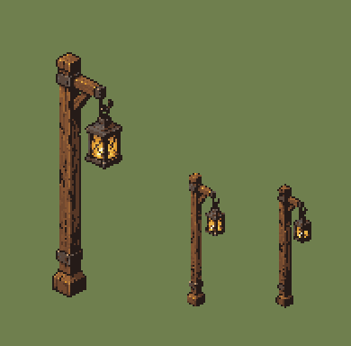
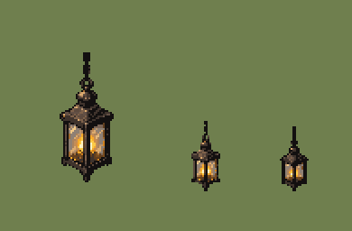
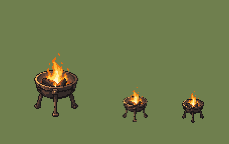

# QA — lighting-source-v1

Source: `art/generated/lighting-source-v1` · exported by `art/tools/export.mjs` · deterministic: re-running gives identical files.

## `PRP_LIGHTING_LANTERN_POST` — variant 01

| | |
|---|---|
| Source | `art/generated/lighting-source-v1/lantern_post_frame01.png` · 793 × 1983 · sha256 `907ba5599426daf5` |
| Output | `art/qa/lighting-source-v1/prp_lighting_lantern_post_01@2x.png` · subject 39 × 136 on 64 × 160 |
| Matte removal | none |
| Palette | 24 colours: `#251b18` `#563726` `#72492f` `#7c4f31` `#835332` `#9a5e2d` `#db962e` `#7d5234` `#9a6436` `#5a473c` `#b47a3c` `#584e4a` `#bd8847` `#e9b145` `#6a5d55` `#6e6158` `#786659` `#8c6c52` `#fad854` `#79695c` `#836b5c` `#b9a065` `#be9a72` `#fcf4d0` |
| Machine checks | **PASS** |
| Human review (0.55 zoom, silhouette) | Claude: pass — reads at 0.55; light contained in the glass, no halo. Not promoted: gate sheets REF_LIGHTING_BALL and REF_SCALE_LINEUP are still drafts. |
| Promoted | no |

- ✅ canvas size — 64 × 160 (spec 64 × 160)
- ✅ binary alpha — every pixel is 0 or 255
- ✅ colour cap — 23 colours (cap 24)
- ✅ no pure black or white — none
- ✅ no functional hue — none
- ✅ pivot — ground row 148, centre 32 (spec 148, 32)
- ✅ @1x is exactly half — 32 × 80

## `PRP_LIGHTING_HANGING_LAMP` — variant 01

| | |
|---|---|
| Source | `art/generated/lighting-source-v1/hanging_lamp_frame01.png` · 1024 × 1536 · sha256 `f94403845d304784` |
| Output | `art/qa/lighting-source-v1/prp_lighting_hanging_lamp_01@2x.png` · subject 30 × 72 on 64 × 96 |
| Matte removal | none |
| Palette | 24 colours: `#131010` `#3f332c` `#613e1e` `#5d4a3e` `#794c1e` `#635045` `#7e614a` `#a16a31` `#7a6456` `#aa825d` `#d1811e` `#d18d46` `#c28d59` `#f8ab2a` `#fcca46` `#8e8074` `#bd966d` `#dcab6f` `#e5b97c` `#f4c985` `#f4c985` `#f5c985` `#fcf1bd` `#fef3c5` |
| Machine checks | **PASS** |
| Human review (0.55 zoom, silhouette) | Claude: pass — reads at 0.55; light contained, no halo. Not promoted: gate sheets REF_LIGHTING_BALL and REF_SCALE_LINEUP are still drafts. |
| Promoted | no |

- ✅ canvas size — 64 × 96 (spec 64 × 96)
- ✅ binary alpha — every pixel is 0 or 255
- ✅ colour cap — 23 colours (cap 24)
- ✅ no pure black or white — none
- ✅ no functional hue — none
- ✅ pivot — ground row 84, centre 31.5 (spec 84, 32)
- ✅ @1x is exactly half — 32 × 48

## `PRP_LIGHTING_BRAZIER` — variant 01

| | |
|---|---|
| Source | `art/generated/lighting-source-v1/brazier_frame01.png` · 1060 × 1484 · sha256 `960a91b1ed4c0380` |
| Output | `art/qa/lighting-source-v1/prp_lighting_brazier_01@2x.png` · subject 44 × 64 on 80 × 112 |
| Matte removal | none |
| Palette | 24 colours: `#191516` `#342a28` `#5a3f33` `#77503d` `#89543b` `#984722` `#955a3d` `#ae5021` `#c85918` `#e06d16` `#ea7616` `#f08418` `#fbb432` `#996b50` `#bd7f51` `#de9654` `#f7b643` `#fcc745` `#e19f5d` `#f4b55d` `#fddb5f` `#fbdf85` `#fdeda8` `#fdf5c8` |
| Machine checks | **PASS** |
| Human review (0.55 zoom, silhouette) | Claude: pass — reads at 0.55; fire contained, no halo. Not promoted: gate sheets REF_LIGHTING_BALL and REF_SCALE_LINEUP are still drafts. |
| Promoted | no |

- ✅ canvas size — 80 × 112 (spec 80 × 112)
- ✅ binary alpha — every pixel is 0 or 255
- ✅ colour cap — 24 colours (cap 24)
- ✅ no pure black or white — none
- ✅ no functional hue — none
- ✅ pivot — ground row 100, centre 39.5 (spec 100, 40)
- ✅ @1x is exactly half — 40 × 56

