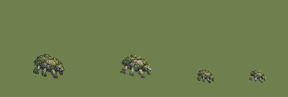

# QA — Moss Crawler contrast v2

Source: `art/generated/moss-crawler-source-v2/moss_crawler_idle_se_contrast.png` · deterministic batch-local build using `art/tools/sprite.mjs`.

| | |
|---|---|
| Output | `monster_moss_crawler_idle_se_02@2x.png` · subject 51×40 on 128×128 |
| Matte removal | dark matte ≤40 luminance, 42372 pixels cleared |
| Palette | 32 colors |
| Machine checks | **PASS** |
| Human review | Codex: **PASS candidate** — the cool dark underside remains a single readable mass at 55%, while pale lichen separates the moss back from Verdant grass. Claude promotion review remains pending. |
| Promoted | no |

- ✅ canvas size — 128 × 128 (spec 128 × 128)
- ✅ binary alpha — every pixel is 0 or 255
- ✅ colour cap — 32 colours (cap 32)
- ✅ no pure black or white — none
- ✅ pivot — ground row 112, centre 64 (spec 112, 64)
- ✅ @1x is exactly half — 64 × 64

Comparison order: v01 at 100%, v02 at 100%, v01 at 55%, v02 at 55%.

The normal shared exporter is temporarily blocked by the committed `partyReturned` notification lacking a matching entry in `art/prompts/src/09-ui-icons.mjs`. This batch-local build does not modify that file and does not promote the asset.
