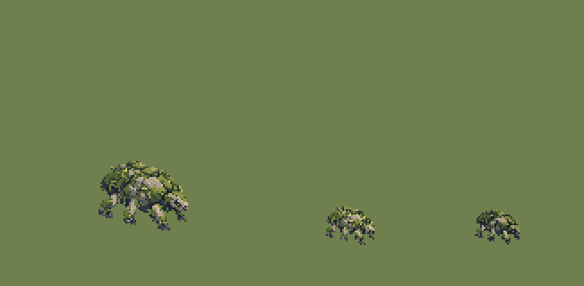

# QA — moss-crawler-source-v2

Source: `art/generated/moss-crawler-source-v2` · exported by `art/tools/export.mjs` · deterministic: re-running gives identical files.

## `MON_MOSS_CRAWLER` — variant 02

| | |
|---|---|
| Source | `art/generated/moss-crawler-source-v2/moss_crawler_idle_se_contrast.png` · 1774 × 887 · sha256 `7ca73fc41d97133e` |
| Output | `art/qa/moss-crawler-source-v2/monster_moss_crawler_idle_se_02@2x.png` · subject 51 × 40 on 128 × 128 |
| Matte removal | dark matte ≤ 40 luminance, 42372 px cleared |
| Palette | 32 colours: `#19212d` `#2d3a2d` `#404e2f` `#262d38` `#343941` `#4e5c33` `#4a4f45` `#4c515a` `#586535` `#69753b` `#5c5954` `#6b645c` `#7c8445` `#6e6b66` `#7c756c` `#899045` `#8d9346` `#8b9248` `#8c934a` `#848b4b` `#898173` `#92887a` `#919748` `#999f4d` `#a0a35e` `#b3b359` `#c0be68` `#d1cd69` `#ac9e89` `#b3a48c` `#bbab91` `#dbc3a5` |
| Machine checks | **PASS** |
| Human review (0.55 zoom, silhouette) | Codex: contrast candidate — darker continuous underside and pale lichen accents improve separation from Verdant grass at 0.55 while preserving the original silhouette. Awaiting Claude QA and owner promotion approval. |
| Promoted | no |

- ✅ canvas size — 128 × 128 (spec 128 × 128)
- ✅ binary alpha — every pixel is 0 or 255
- ✅ colour cap — 32 colours (cap 32)
- ✅ no pure black or white — none
- ✅ pivot — ground row 112, centre 63.5 (spec 112, 64)
- ✅ @1x is exactly half — 64 × 64

