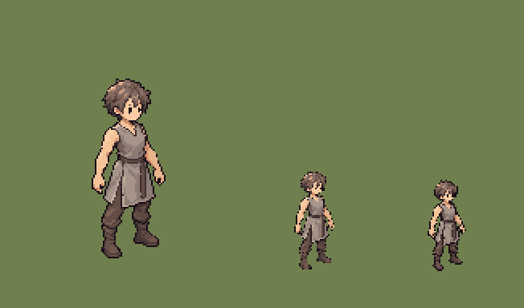
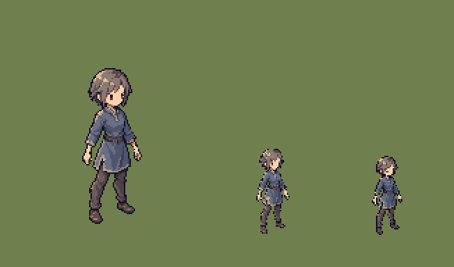
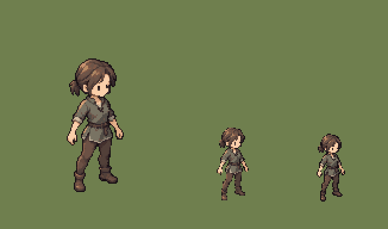
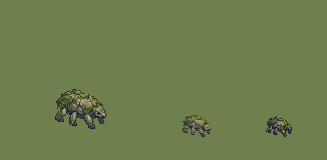

# QA — proof-cycle-actors-source-v1

Source: `art/generated/proof-cycle-actors-source-v1` · exported by `art/tools/export.mjs` · deterministic: re-running gives identical files.

## `HUN_SKEL_VANGUARD` — variant 01

| | |
|---|---|
| Source | `art/generated/proof-cycle-actors-source-v1/vanguard_idle_se_candidate.png` · 1122 × 1402 · sha256 `0d872b1bd708bbd8` |
| Output | `art/qa/proof-cycle-actors-source-v1/hunter_vanguard_skel_idle_se_01@2x.png` · subject 46 × 112 on 128 × 160 |
| Matte removal | none |
| Palette | 32 colours: `#180d17` `#271a21` `#3f3132` `#4b3a39` `#5e4840` `#654e46` `#71574c` `#75605b` `#7e6256` `#84695f` `#877068` `#8b7b74` `#927e76` `#a19085` `#c57f62` `#ce8b6a` `#aa8a79` `#ba8c74` `#d1906f` `#a6948a` `#a7968b` `#d89975` `#dca481` `#e9b38a` `#b5a295` `#c5af9e` `#e9b58d` `#e9b68f` `#dfbea3` `#e2c6ae` `#f5c398` `#facda4` |
| Machine checks | **PASS** |
| Human review (0.55 zoom, silhouette) | Claude: FAIL as a HUN_SKEL rig, PASS as the DL-069 proportion proof. The soft-chibi 1:4.5 style is right. Two rig failures: (1) all three archetypes share one body and stance, so ART_BIBLE §8.1 role read fails at 0.55 — the vanguard must be broad and planted, the adept upright and narrow, the ranger leaning and asymmetric; (2) clothing is baked in, where spec 02 needs a plain grey undergarment so outfit layers go on top. |
| Promoted | no |

- ✅ canvas size — 128 × 160 (spec 128 × 160)
- ✅ binary alpha — every pixel is 0 or 255
- ✅ colour cap — 31 colours (cap 32)
- ✅ no pure black or white — none
- ✅ pivot — ground row 144, centre 63.5 (spec 144, 64)
- ✅ @1x is exactly half — 64 × 80

## `HUN_SKEL_ADEPT` — variant 01

| | |
|---|---|
| Source | `art/generated/proof-cycle-actors-source-v1/adept_idle_se_candidate.png` · 1122 × 1402 · sha256 `46452bd28abbf85c` |
| Output | `art/qa/proof-cycle-actors-source-v1/hunter_adept_skel_idle_se_01@2x.png` · subject 43 × 112 on 128 × 160 |
| Matte removal | none |
| Palette | 32 colours: `#111024` `#141329` `#292433` `#413439` `#3d4054` `#4f4246` `#4e556d` `#634c47` `#685756` `#6c5e5f` `#6a7083` `#826a63` `#86736d` `#897770` `#8a7a74` `#8c6053` `#8c7a71` `#8d7a72` `#8c7a73` `#8c7a73` `#8c7b75` `#976853` `#8f7c73` `#94837b` `#aa7f65` `#a38f82` `#c18568` `#b39e8e` `#d49d7f` `#d4b494` `#e9be97` `#fad3ad` |
| Machine checks | **PASS** |
| Human review (0.55 zoom, silhouette) | Claude: FAIL as a HUN_SKEL rig, PASS as the DL-069 proportion proof. The soft-chibi 1:4.5 style is right. Two rig failures: (1) all three archetypes share one body and stance, so ART_BIBLE §8.1 role read fails at 0.55 — the vanguard must be broad and planted, the adept upright and narrow, the ranger leaning and asymmetric; (2) clothing is baked in, where spec 02 needs a plain grey undergarment so outfit layers go on top. |
| Promoted | no |

- ✅ canvas size — 128 × 160 (spec 128 × 160)
- ✅ binary alpha — every pixel is 0 or 255
- ✅ colour cap — 31 colours (cap 32)
- ✅ no pure black or white — none
- ✅ pivot — ground row 144, centre 64 (spec 144, 64)
- ✅ @1x is exactly half — 64 × 80

## `HUN_SKEL_RANGER` — variant 01

| | |
|---|---|
| Source | `art/generated/proof-cycle-actors-source-v1/ranger_idle_se_candidate.png` · 1122 × 1402 · sha256 `7cd4d2a3b106cce7` |
| Output | `art/qa/proof-cycle-actors-source-v1/hunter_ranger_skel_idle_se_01@2x.png` · subject 48 × 112 on 128 × 160 |
| Matte removal | none |
| Palette | 32 colours: `#181015` `#281919` `#33272b` `#43302d` `#4a3a36` `#524039` `#534d46` `#63483d` `#6c5145` `#6d5549` `#746d5f` `#7c5746` `#7a6a5a` `#797363` `#7a7464` `#8c614b` `#916e57` `#938475` `#a9785b` `#af8763` `#ba8a63` `#b38d70` `#c89270` `#ca9e72` `#daa27b` `#b4a38d` `#c3b29b` `#dca683` `#d0b99e` `#e4b08a` `#f2c39e` `#facfaa` |
| Machine checks | **PASS** |
| Human review (0.55 zoom, silhouette) | Claude: FAIL as a HUN_SKEL rig, PASS as the DL-069 proportion proof. The soft-chibi 1:4.5 style is right. Two rig failures: (1) all three archetypes share one body and stance, so ART_BIBLE §8.1 role read fails at 0.55 — the vanguard must be broad and planted, the adept upright and narrow, the ranger leaning and asymmetric; (2) clothing is baked in, where spec 02 needs a plain grey undergarment so outfit layers go on top. |
| Promoted | no |

- ✅ canvas size — 128 × 160 (spec 128 × 160)
- ✅ binary alpha — every pixel is 0 or 255
- ✅ colour cap — 32 colours (cap 32)
- ✅ no pure black or white — none
- ✅ pivot — ground row 144, centre 63.5 (spec 144, 64)
- ✅ @1x is exactly half — 64 × 80

## `MON_MOSS_CRAWLER` — variant 01

| | |
|---|---|
| Source | `art/generated/proof-cycle-actors-source-v1/moss_crawler_idle_se_candidate.png` · 1774 × 887 · sha256 `d22cc9d611f4c084` |
| Output | `art/qa/proof-cycle-actors-source-v1/monster_moss_crawler_idle_se_01@2x.png` · subject 51 × 40 on 128 × 128 |
| Matte removal | none |
| Palette | 32 colours: `#182027` `#1a2430` `#1b2432` `#2b372d` `#434f2d` `#1d2634` `#283337` `#374135` `#4a5435` `#353942` `#484747` `#484d55` `#5b6633` `#5a5851` `#6c7538` `#676553` `#6b6760` `#747a3a` `#7c833c` `#8a8d3e` `#909341` `#7a7364` `#909343` `#8d8370` `#a1a146` `#9d9079` `#b7b54f` `#a2947b` `#a3957d` `#a99981` `#c1ac8d` `#d2b894` |
| Machine checks | **PASS** |
| Human review (0.55 zoom, silhouette) | Claude: pass with a note — reads as a creature at 0.55, but moss green on Verdant Reach grass risks the camouflage spec 03 warns against; a darker bark underside or lighter lichen highlights would separate it. Not promoted: gate sheets REF_LIGHTING_BALL and REF_SCALE_LINEUP are still drafts. |
| Promoted | no |

- ✅ canvas size — 128 × 128 (spec 128 × 128)
- ✅ binary alpha — every pixel is 0 or 255
- ✅ colour cap — 32 colours (cap 32)
- ✅ no pure black or white — none
- ✅ pivot — ground row 112, centre 64 (spec 112, 64)
- ✅ @1x is exactly half — 64 × 64

