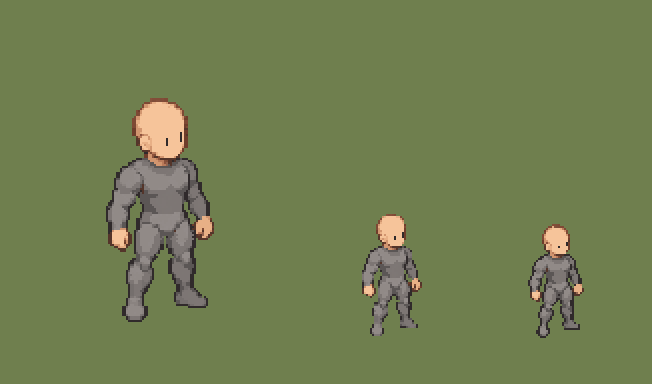
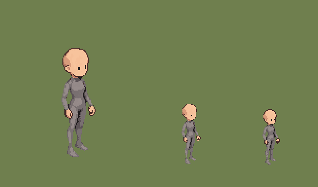
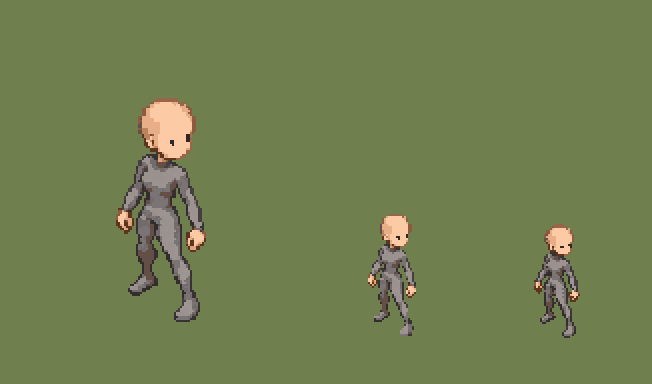

# QA — proof-cycle-rigs-source-v2

Source: `art/generated/proof-cycle-rigs-source-v2` · exported by `art/tools/export.mjs` · deterministic: re-running gives identical files.

## `HUN_SKEL_VANGUARD` — variant 02

| | |
|---|---|
| Source | `art/generated/proof-cycle-rigs-source-v2/vanguard_idle_se.png` · 1199 × 1312 · sha256 `6688222857efd17b` |
| Output | `art/qa/proof-cycle-rigs-source-v2/hunter_vanguard_skel_idle_se_02@2x.png` · subject 54 × 112 on 128 × 160 |
| Matte removal | dark matte ≤ 40 luminance, 1736 px cleared |
| Palette | 32 colours: `#302a2b` `#54352a` `#6e3d2b` `#5b5655` `#756f6d` `#7e4934` `#7d7674` `#7d7674` `#7d7674` `#7d7674` `#7d7774` `#7d7775` `#7e4a35` `#7e4d39` `#7e7774` `#7e7774` `#7e7774` `#7e7775` `#824d38` `#86513b` `#8c523c` `#92634f` `#b97a5a` `#8a8380` `#918a87` `#928b89` `#938c8a` `#948d8a` `#b78d74` `#d1956f` `#e8b086` `#f6c49a` |
| Machine checks | **PASS** |
| Human review (0.55 zoom, silhouette) | Codex: candidate — broad, low and planted; bald neutral-grey paper-doll base with no baked outfit. Awaiting Claude QA and owner silhouette approval. |
| Promoted | no |

- ✅ canvas size — 128 × 160 (spec 128 × 160)
- ✅ binary alpha — every pixel is 0 or 255
- ✅ colour cap — 26 colours (cap 32)
- ✅ no pure black or white — none
- ✅ pivot — ground row 144, centre 63.5 (spec 144, 64)
- ✅ @1x is exactly half — 64 × 80

## `HUN_SKEL_ADEPT` — variant 02

| | |
|---|---|
| Source | `art/generated/proof-cycle-rigs-source-v2/adept_idle_se.png` · 1024 × 1536 · sha256 `f182044cc57d330f` |
| Output | `art/qa/proof-cycle-rigs-source-v2/hunter_adept_skel_idle_se_02@2x.png` · subject 36 × 112 on 128 × 160 |
| Matte removal | dark matte ≤ 40 luminance, 25894 px cleared |
| Palette | 32 colours: `#242021` `#3e2726` `#4a2b29` `#4c2d2b` `#4e2d2b` `#51312e` `#544c50` `#595154` `#5d5457` `#6f6768` `#7b4b43` `#766d6e` `#766d6e` `#766d6e` `#766d6e` `#776d6e` `#776e6f` `#786f70` `#797071` `#7c7373` `#948988` `#968b8a` `#b0715f` `#978b8a` `#978b8a` `#978c8b` `#978c8b` `#ba7a65` `#c98c72` `#d89b7b` `#f5bf98` `#f7c39c` |
| Machine checks | **PASS** |
| Human review (0.55 zoom, silhouette) | Codex: candidate after dark-matte cleanup — narrow, upright and vertical; bald neutral-grey paper-doll base with no baked outfit. Awaiting Claude QA and owner silhouette approval. |
| Promoted | no |

- ✅ canvas size — 128 × 160 (spec 128 × 160)
- ✅ binary alpha — every pixel is 0 or 255
- ✅ colour cap — 27 colours (cap 32)
- ✅ no pure black or white — none
- ✅ pivot — ground row 144, centre 64 (spec 144, 64)
- ✅ @1x is exactly half — 64 × 80

## `HUN_SKEL_RANGER` — variant 02

| | |
|---|---|
| Source | `art/generated/proof-cycle-rigs-source-v2/ranger_idle_se.png` · 1199 × 1312 · sha256 `fc7b8b2d44ad7d89` |
| Output | `art/qa/proof-cycle-rigs-source-v2/hunter_ranger_skel_idle_se_02@2x.png` · subject 45 × 112 on 128 × 160 |
| Matte removal | dark matte ≤ 40 luminance, 44 px cleared |
| Palette | 32 colours: `#302725` `#342d2d` `#393232` `#423632` `#463f3f` `#5c351e` `#634f46` `#726b6b` `#8d5c3e` `#976648` `#92684e` `#7b7474` `#7c7475` `#8c8483` `#a7704f` `#bb825e` `#bb8360` `#bb8463` `#99908e` `#c28963` `#9b9290` `#9d9492` `#9e9693` `#a09996` `#a39c99` `#dca279` `#dca37c` `#dda37c` `#e2a982` `#e7ae88` `#f8c59f` `#fccba6` |
| Machine checks | **PASS** |
| Human review (0.55 zoom, silhouette) | Codex: candidate — lean, forward and asymmetric; bald neutral-grey paper-doll base with no baked outfit. Awaiting Claude QA and owner silhouette approval. |
| Promoted | no |

- ✅ canvas size — 128 × 160 (spec 128 × 160)
- ✅ binary alpha — every pixel is 0 or 255
- ✅ colour cap — 32 colours (cap 32)
- ✅ no pure black or white — none
- ✅ pivot — ground row 144, centre 64 (spec 144, 64)
- ✅ @1x is exactly half — 64 × 80

