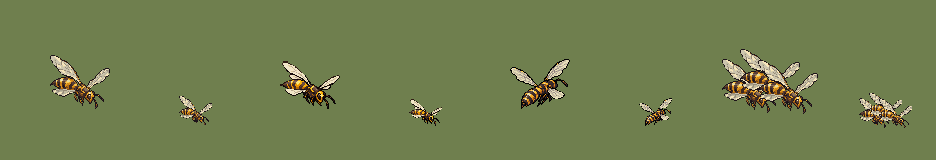

# QA — Thicket Wasp source v1

Sources: `art/generated/thicket-wasp-source-v1/thicket_wasp_idle_se_candidate.png`, `art/generated/thicket-wasp-source-v1/thicket_wasp_idle_ne_candidate.png` · deterministic batch-local normalization using `art/tools/sprite.mjs`.

| | |
|---|---|
| SE output | subject 60×54 on 128×128 |
| SE frame 02 | subject 60×48 on 128×128 |
| NE output | subject 60×50 on 128×128 |
| Hover | sprite bottom y=92; ground pivot `(64,112)`; 20 px @2x offset |
| Palette | SE-01 24; SE-02 24; NE-01 24 colors |
| Machine checks | **PASS** — both authored facings and frame 02 |
| Human review | Codex: **PASS candidate** — both facings and the downstroke retain their body segments and four-wing read at 55%; the three-wasp overlap still counts as three. |
| Promoted | no |

- ✅ SE canvas size — 128 × 128 (spec 128 × 128)
- ✅ SE binary alpha — every pixel is 0 or 255
- ✅ SE colour cap — 24 colours (cap 32)
- ✅ SE no pure black or white — none
- ✅ SE @1x is exactly half — 64 × 64
- ✅ SE-02 canvas size — 128 × 128 (spec 128 × 128)
- ✅ SE-02 binary alpha — every pixel is 0 or 255
- ✅ SE-02 colour cap — 24 colours (cap 32)
- ✅ SE-02 no pure black or white — none
- ✅ SE-02 @1x is exactly half — 64 × 64
- ✅ NE canvas size — 128 × 128 (spec 128 × 128)
- ✅ NE binary alpha — every pixel is 0 or 255
- ✅ NE colour cap — 24 colours (cap 32)
- ✅ NE no pure black or white — none
- ✅ NE @1x is exactly half — 64 × 64

Sheet order: SE-01 at 100% and 55%, SE-02 at 100% and 55%, NE-01 at 100% and 55%, three-wasp SE overlap at 100% and 55%.
