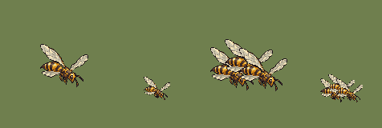

# QA — Thicket Wasp source v1

Source: `art/generated/thicket-wasp-source-v1/thicket_wasp_idle_se_candidate.png` · deterministic batch-local normalization using `art/tools/sprite.mjs`.

| | |
|---|---|
| Output | `monster_thicket_wasp_idle_se_01@2x.png` · subject 60×54 on 128×128 |
| Hover | sprite bottom y=92; ground pivot `(64,112)`; 20 px @2x offset |
| Palette | 24 colors |
| Machine checks | **PASS** |
| Human review | Codex: **PASS candidate** — head, thorax, abdomen and four wing shapes remain legible at 55%; three overlapping wasps still count as three. |
| Promoted | no |

- ✅ canvas size — 128 × 128 (spec 128 × 128)
- ✅ binary alpha — every pixel is 0 or 255
- ✅ colour cap — 24 colours (cap 32)
- ✅ no pure black or white — none
- ✅ @1x is exactly half — 64 × 64

Sheet order: single at 100%, single at 55%, three-wasp overlap at 100%, overlap at 55%.
