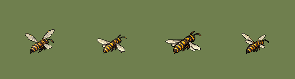
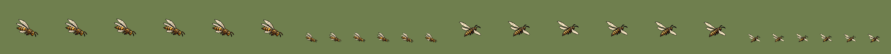
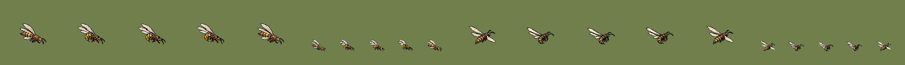

# QA — Thicket Wasp source v1

Sources: `art/generated/thicket-wasp-source-v1/thicket_wasp_idle_se_candidate.png`, `art/generated/thicket-wasp-source-v1/thicket_wasp_idle_ne_candidate.png` · deterministic batch-local normalization using `art/tools/sprite.mjs`.

| | |
|---|---|
| SE output | subject 60×54 on 128×128 |
| SE frame 02 | subject 60×48 on 128×128 |
| SE frame 03 | subject 72×39 on 128×128 |
| SE frame 04 | subject 55×55 on 128×128 |
| NE output | subject 60×50 on 128×128 |
| NE derived frames 02–04 | 60×50, 60×50, 60×50 |
| Hover | sprite bottom y=92; ground pivot `(64,112)`; 20 px @2x offset |
| Palette | SE frames 24/24/24/24; NE frames 24/24/24/24 colors |
| Machine checks | **PASS** — all four facings; SE/NE authored bases, SW/NW mirrors |
| Human review | Codex: **PASS candidate.** SE uses four generated wing poses; NE uses the approved base with an exact body-locked 0/-1/-2/-1 hover and restrained wing-ramp pulse. Both mirror safely, retain four wings, and remain countable at 55%. The three rejected NE generations remain provenance only. |
| Promoted | no |

- ✅ SE canvas size — 128 × 128 (spec 128 × 128)
- ✅ SE binary alpha — every pixel is 0 or 255
- ✅ SE colour cap — 24 colours (cap 32)
- ✅ SE no pure black or white — none
- ✅ SE @1x is exactly half — 64 × 64
- ✅ SE-02 canvas size — 128 × 128 (spec 128 × 128)
- ✅ SE-02 binary alpha — every pixel is 0 or 255
- ✅ SE-02 colour cap — 24 colours (cap 32)
- ✅ SE-02 no pure black or white — none
- ✅ SE-02 @1x is exactly half — 64 × 64
- ✅ SE-03 canvas size — 128 × 128 (spec 128 × 128)
- ✅ SE-03 binary alpha — every pixel is 0 or 255
- ✅ SE-03 colour cap — 23 colours (cap 32)
- ✅ SE-03 no pure black or white — none
- ✅ SE-03 @1x is exactly half — 64 × 64
- ✅ SE-04 canvas size — 128 × 128 (spec 128 × 128)
- ✅ SE-04 binary alpha — every pixel is 0 or 255
- ✅ SE-04 colour cap — 24 colours (cap 32)
- ✅ SE-04 no pure black or white — none
- ✅ SE-04 @1x is exactly half — 64 × 64
- ✅ NE canvas size — 128 × 128 (spec 128 × 128)
- ✅ NE binary alpha — every pixel is 0 or 255
- ✅ NE colour cap — 24 colours (cap 32)
- ✅ NE no pure black or white — none
- ✅ NE @1x is exactly half — 64 × 64

- ✅ NE-02 derived canvas size — 128 × 128 (spec 128 × 128)
- ✅ NE-02 derived binary alpha — every pixel is 0 or 255
- ✅ NE-02 derived colour cap — 24 colours (cap 32)
- ✅ NE-02 derived no pure black or white — none
- ✅ NE-02 derived @1x is exactly half — 64 × 64
- ✅ NE-03 derived canvas size — 128 × 128 (spec 128 × 128)
- ✅ NE-03 derived binary alpha — every pixel is 0 or 255
- ✅ NE-03 derived colour cap — 24 colours (cap 32)
- ✅ NE-03 derived no pure black or white — none
- ✅ NE-03 derived @1x is exactly half — 64 × 64
- ✅ NE-04 derived canvas size — 128 × 128 (spec 128 × 128)
- ✅ NE-04 derived binary alpha — every pixel is 0 or 255
- ✅ NE-04 derived colour cap — 24 colours (cap 32)
- ✅ NE-04 derived no pure black or white — none
- ✅ NE-04 derived @1x is exactly half — 64 × 64

Sheet order: SE frames 01–04 and strip at 55%, NE frames 01–04 and strip at 55%, three-wasp SE overlap at 100% and 55%.

Rejected generated NE intermediates (frame 01 reference, then rejected 02–04):

## Fly / walk state

Authored key poses: `art/generated/thicket-wasp-source-v1/thicket_wasp_fly_se_key_candidate.png`, `art/generated/thicket-wasp-source-v1/thicket_wasp_fly_ne_key_candidate.png`. Six-frame cycles use exact body-locked offsets and wing-ramp pulses; SW/NW are mirrors.

- ✅ all 12 authored-direction fly frames pass machine validation
- ✅ distance-driven sidecars use two tiles per cycle; flying has no ground-contact frames
- ✅ Codex visual review: travel lean reads separately from idle at 55%; body identity remains fixed through each cycle

## Attack state

Authored impact keys: `art/generated/thicket-wasp-source-v1/thicket_wasp_attack_se_impact_candidate.png`, `art/generated/thicket-wasp-source-v1/thicket_wasp_attack_ne_impact-v2_candidate.png`. Frame 03 is the sting impact; frames 01/05 use the travel pose and 02/04 move through the lunge. SW/NW are exact mirrors.

- ✅ all 10 authored-direction action frames pass machine validation
- ✅ action sidecars are non-looping at 12 × game speed with key frame 03
- ✅ Codex visual review: sting curl and forward lunge remain distinct from travel at 55%; no gore or venom glow

