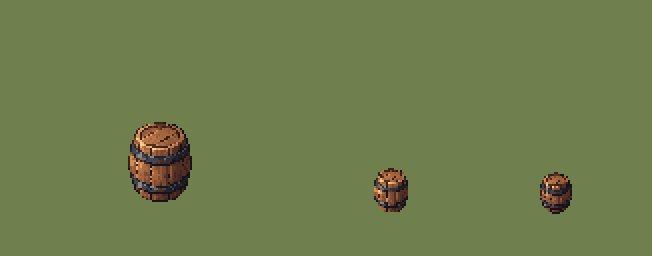
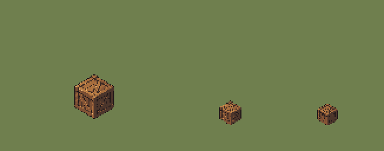
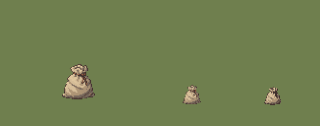

# QA — town-props-source-v1

Source: `art/generated/town-props-source-v1` · exported by `art/tools/export.mjs` · deterministic: re-running gives identical files.

## `PRP_TOWN_BASIC_BARREL` — variant 01

| | |
|---|---|
| Source | `art/generated/town-props-source-v1/barrel.png` · 1448 × 1086 · sha256 `9980023005dd249b` |
| Output | `art/qa/town-props-source-v1/prp_town_basic_barrel_01@2x.png` · subject 32 × 40 on 128 × 96 |
| Matte removal | none |
| Palette | 24 colours: `#181117` `#39201b` `#1a1c26` `#3e2723` `#502e22` `#20222d` `#322e35` `#424451` `#5f3727` `#774731` `#7d4b33` `#755142` `#915839` `#a3643d` `#a9693f` `#706f70` `#8d6f5b` `#ab6c43` `#8c8781` `#b87545` `#d08d54` `#e19f61` `#efb270` `#f9d08d` |
| Machine checks | **PASS** |
| Human review (0.55 zoom, silhouette) | Claude: pass — reads at 0.55. Not promoted: gate sheets REF_LIGHTING_BALL and REF_SCALE_LINEUP are still drafts. |
| Promoted | no |

- ✅ canvas size — 128 × 96 (spec 128 × 96)
- ✅ binary alpha — every pixel is 0 or 255
- ✅ colour cap — 22 colours (cap 24)
- ✅ no pure black or white — none
- ✅ no functional hue — none
- ✅ pivot — ground row 84, centre 63.5 (spec 84, 64)
- ✅ @1x is exactly half — 64 × 48

## `PRP_TOWN_BASIC_CRATE` — variant 01

| | |
|---|---|
| Source | `art/generated/town-props-source-v1/crate.png` · 1448 × 1086 · sha256 `4cd2365aa4626f41` |
| Output | `art/qa/town-props-source-v1/prp_town_basic_crate_01@2x.png` · subject 34 × 38 on 128 × 96 |
| Matte removal | none |
| Palette | 24 colours: `#23191a` `#332421` `#3d2b24` `#463128` `#4b352b` `#4c352b` `#4d362b` `#4f372c` `#5a3c2c` `#6e4630` `#764b31` `#7a4d32` `#784e35` `#7d5034` `#885636` `#9e663b` `#a76d3d` `#af7541` `#b87c45` `#be8349` `#cb8e4e` `#d59b5b` `#e7af68` `#eeb874` |
| Machine checks | **PASS** |
| Human review (0.55 zoom, silhouette) | Claude: pass — cube silhouette reads; detail busy at 0.55 but acceptable. Not promoted: gate sheets REF_LIGHTING_BALL and REF_SCALE_LINEUP are still drafts. |
| Promoted | no |

- ✅ canvas size — 128 × 96 (spec 128 × 96)
- ✅ binary alpha — every pixel is 0 or 255
- ✅ colour cap — 24 colours (cap 24)
- ✅ no pure black or white — none
- ✅ no functional hue — none
- ✅ pivot — ground row 84, centre 63.5 (spec 84, 64)
- ✅ @1x is exactly half — 64 × 48

## `PRP_TOWN_BASIC_SACK` — variant 01

| | |
|---|---|
| Source | `art/generated/town-props-source-v1/sack.png` · 1448 × 1086 · sha256 `25f151b19ae43710` |
| Output | `art/qa/town-props-source-v1/prp_town_basic_sack_01@2x.png` · subject 34 × 36 on 128 × 96 |
| Matte removal | none |
| Palette | 24 colours: `#40302c` `#554239` `#5c483f` `#65564e` `#754936` `#745748` `#746459` `#746459` `#756559` `#75665a` `#77675b` `#7a6456` `#79695d` `#945c41` `#806e60` `#997158` `#a28a6f` `#a78f72` `#ab9275` `#ad9475` `#b09677` `#b9a07f` `#d5bd98` `#dec59d` |
| Machine checks | **PASS** |
| Human review (0.55 zoom, silhouette) | Claude: pass — reads at 0.55. Not promoted: gate sheets REF_LIGHTING_BALL and REF_SCALE_LINEUP are still drafts. |
| Promoted | no |

- ✅ canvas size — 128 × 96 (spec 128 × 96)
- ✅ binary alpha — every pixel is 0 or 255
- ✅ colour cap — 21 colours (cap 24)
- ✅ no pure black or white — none
- ✅ no functional hue — none
- ✅ pivot — ground row 84, centre 63.5 (spec 84, 64)
- ✅ @1x is exactly half — 64 × 48

