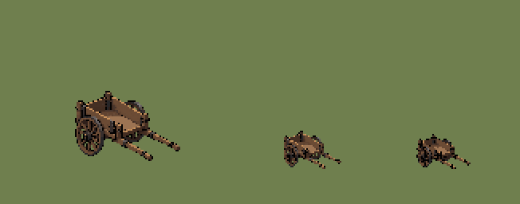
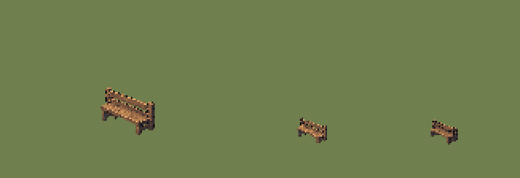
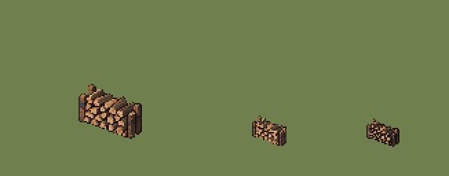
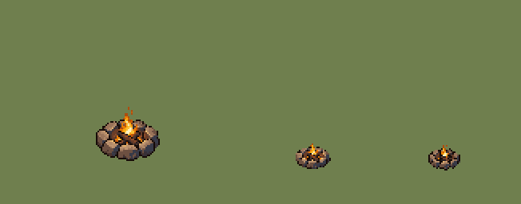
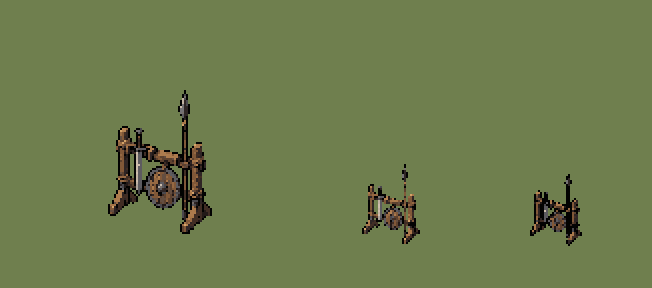
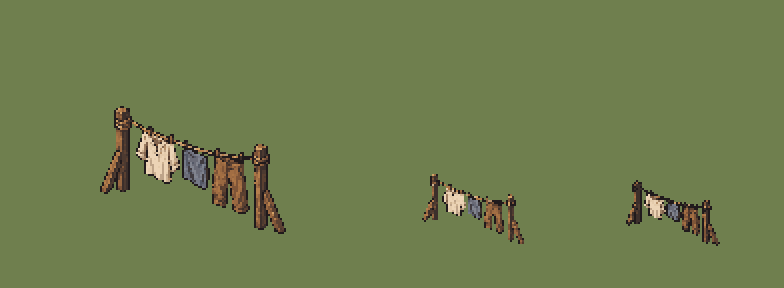

# QA — town-props-source-v2

Source: `art/generated/town-props-source-v2` · exported by `art/tools/export.mjs` · deterministic: re-running gives identical files.

## `PRP_TOWN_BASIC_HANDCART` — variant 01

| | |
|---|---|
| Source | `art/generated/town-props-source-v2/handcart_se.png` · 1448 × 1086 · sha256 `0646c6bfa90e9edc` |
| Output | `art/qa/town-props-source-v2/prp_town_basic_handcart_01@2x.png` · subject 66 × 44 on 128 × 96 |
| Matte removal | none |
| Palette | 24 colours: `#020101` `#080607` `#2f1f1a` `#272628` `#382f2d` `#432d21` `#452f23` `#49362d` `#614330` `#694a34` `#694a34` `#684b37` `#594f4a` `#645d5d` `#6c4b34` `#6c4c35` `#6f4e37` `#74523c` `#6e5f56` `#896649` `#7a7473` `#9d7453` `#b78556` `#cb935c` |
| Machine checks | **PASS** |
| Human review (0.55 zoom, silhouette) | Claude: pass — reads at 0.55; fits the 1×1 canvas after export. Not promoted: gate sheets REF_LIGHTING_BALL and REF_SCALE_LINEUP are still drafts. |
| Promoted | no |

- ✅ canvas size — 128 × 96 (spec 128 × 96)
- ✅ binary alpha — every pixel is 0 or 255
- ✅ colour cap — 22 colours (cap 24)
- ✅ no pure black or white — none
- ✅ no functional hue — none
- ✅ pivot — ground row 84, centre 63.5 (spec 84, 64)
- ✅ @1x is exactly half — 64 × 48

## `PRP_TOWN_BASIC_BENCH` — variant 01

| | |
|---|---|
| Source | `art/generated/town-props-source-v2/bench_se.png` · 1448 × 1086 · sha256 `c069b1a0c74c1666` |
| Output | `art/qa/town-props-source-v2/prp_town_basic_bench_01@2x.png` · subject 34 × 30 on 128 × 80 |
| Matte removal | none |
| Palette | 24 colours: `#110e13` `#141015` `#322a2c` `#372e2e` `#3b3131` `#3c3232` `#39363a` `#373b43` `#433633` `#503d34` `#5c4336` `#674a39` `#72503b` `#7e573e` `#865d41` `#946747` `#9b6b48` `#a5734b` `#b47e4f` `#ba8453` `#c68d57` `#cf965d` `#dca366` `#e4ab6c` |
| Machine checks | **PASS** |
| Human review (0.55 zoom, silhouette) | Claude: pass — reads at 100 %; small but recognisable at 0.55. Not promoted: gate sheets REF_LIGHTING_BALL and REF_SCALE_LINEUP are still drafts. |
| Promoted | no |

- ✅ canvas size — 128 × 80 (spec 128 × 80)
- ✅ binary alpha — every pixel is 0 or 255
- ✅ colour cap — 23 colours (cap 24)
- ✅ no pure black or white — none
- ✅ no functional hue — none
- ✅ pivot — ground row 68, centre 63.5 (spec 68, 64)
- ✅ @1x is exactly half — 64 × 40

## `PRP_TOWN_BASIC_WOODPILE` — variant 01

| | |
|---|---|
| Source | `art/generated/town-props-source-v2/woodpile.png` · 1448 × 1086 · sha256 `5bd98bc2121bd714` |
| Output | `art/qa/town-props-source-v2/prp_town_basic_woodpile_01@2x.png` · subject 46 × 40 on 128 × 96 |
| Matte removal | none |
| Palette | 24 colours: `#150e0d` `#211613` `#32241e` `#3c2b22` `#2e2728` `#413026` `#463227` `#3d312c` `#48362b` `#322e31` `#4a3a31` `#4c3a30` `#4a3d37` `#484b52` `#553f33` `#664b3a` `#71513c` `#855a3d` `#976743` `#b17b4f` `#c28c5d` `#d29f6f` `#dba879` `#e1ae7d` |
| Machine checks | **PASS** |
| Human review (0.55 zoom, silhouette) | Claude: pass — reads at 0.55; four posts instead of the requested two, acceptable. Not promoted: gate sheets REF_LIGHTING_BALL and REF_SCALE_LINEUP are still drafts. |
| Promoted | no |

- ✅ canvas size — 128 × 96 (spec 128 × 96)
- ✅ binary alpha — every pixel is 0 or 255
- ✅ colour cap — 24 colours (cap 24)
- ✅ no pure black or white — none
- ✅ no functional hue — none
- ✅ pivot — ground row 84, centre 63.5 (spec 84, 64)
- ✅ @1x is exactly half — 64 × 48

## `PRP_TOWN_BASIC_FIREPIT` — variant 01

| | |
|---|---|
| Source | `art/generated/town-props-source-v2/firepit_frame01.png` · 1448 × 1086 · sha256 `536f7ab9043cc5fa` |
| Output | `art/qa/town-props-source-v2/prp_town_basic_firepit_01@2x.png` · subject 40 × 34 on 128 × 96 |
| Matte removal | none |
| Palette | 24 colours: `#160b07` `#241c1e` `#373037` `#383a48` `#4c352d` `#6b3d27` `#6d5041` `#ae4d0e` `#8e4d2b` `#c95a06` `#e87c05` `#f8a911` `#fcc137` `#9a745a` `#b08868` `#b88e6b` `#c6976b` `#e5b068` `#be946f` `#cfa071` `#f2c676` `#f6cf7c` `#fdedae` `#fdf3c2` |
| Machine checks | **PASS** |
| Human review (0.55 zoom, silhouette) | Claude: pass — reads at 0.55; usable as the reduced-motion frame 01. Not promoted: gate sheets REF_LIGHTING_BALL and REF_SCALE_LINEUP are still drafts. |
| Promoted | no |

- ✅ canvas size — 128 × 96 (spec 128 × 96)
- ✅ binary alpha — every pixel is 0 or 255
- ✅ colour cap — 24 colours (cap 24)
- ✅ no pure black or white — none
- ✅ no functional hue — none
- ✅ pivot — ground row 84, centre 63.5 (spec 84, 64)
- ✅ @1x is exactly half — 64 × 48

## `PRP_TOWN_BASIC_WEAPON_RACK` — variant 01

| | |
|---|---|
| Source | `art/generated/town-props-source-v2/weapon_rack.png` · 1448 × 1086 · sha256 `8ab29554b82a6110` |
| Output | `art/qa/town-props-source-v2/prp_town_basic_weapon_rack_01@2x.png` · subject 52 × 72 on 128 × 112 |
| Matte removal | none |
| Palette | 24 colours: `#020201` `#040404` `#221918` `#2f2525` `#412d24` `#5e422f` `#4a484d` `#644e41` `#5d5b60` `#815838` `#966943` `#a87749` `#ac7a4d` `#ae7c4e` `#786f6c` `#7c726c` `#997657` `#747174` `#747275` `#ada39b` `#b78453` `#d4a369` `#c1b2a2` `#cdbdad` |
| Machine checks | **PASS** |
| Human review (0.55 zoom, silhouette) | Claude: pass — reads at 0.55; exported at 72 px so it stays under hunter shoulder height. Not promoted: gate sheets REF_LIGHTING_BALL and REF_SCALE_LINEUP are still drafts. |
| Promoted | no |

- ✅ canvas size — 128 × 112 (spec 128 × 112)
- ✅ binary alpha — every pixel is 0 or 255
- ✅ colour cap — 23 colours (cap 24)
- ✅ no pure black or white — none
- ✅ no functional hue — none
- ✅ pivot — ground row 100, centre 63.5 (spec 100, 64)
- ✅ @1x is exactly half — 64 × 56

## `PRP_TOWN_BASIC_WASHING_LINE` — variant 01

| | |
|---|---|
| Source | `art/generated/town-props-source-v2/washing_line_se.png` · 1448 × 1086 · sha256 `0b7e91a192667477` |
| Output | `art/qa/town-props-source-v2/prp_town_basic_washing_line_01@2x.png` · subject 93 × 64 on 160 × 112 |
| Matte removal | none |
| Palette | 24 colours: `#201a1c` `#3c2f2b` `#50372b` `#4d3a30` `#5b4030` `#413c41` `#5b4234` `#545866` `#7f5538` `#996841` `#82644e` `#6a6b77` `#a26e43` `#ab7546` `#9e7f63` `#767a88` `#81848f` `#b57f4d` `#b8936d` `#bea489` `#d4a368` `#ceb392` `#e5ccac` `#ecd4b6` |
| Machine checks | **PASS** |
| Human review (0.55 zoom, silhouette) | Claude: pass — reads at 0.55; garment blue-grey is clear of the functional blue. Not promoted: gate sheets REF_LIGHTING_BALL and REF_SCALE_LINEUP are still drafts. |
| Promoted | no |

- ✅ canvas size — 160 × 112 (spec 160 × 112)
- ✅ binary alpha — every pixel is 0 or 255
- ✅ colour cap — 24 colours (cap 24)
- ✅ no pure black or white — none
- ✅ no functional hue — none
- ✅ pivot — ground row 100, centre 80 (spec 100, 80)
- ✅ @1x is exactly half — 80 × 56

