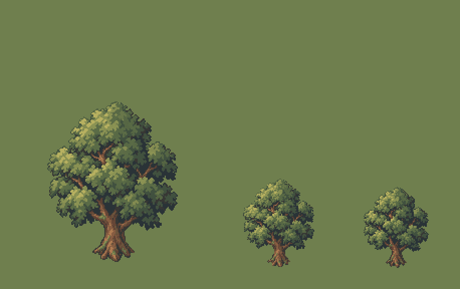
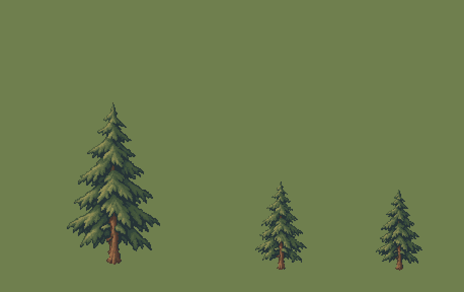
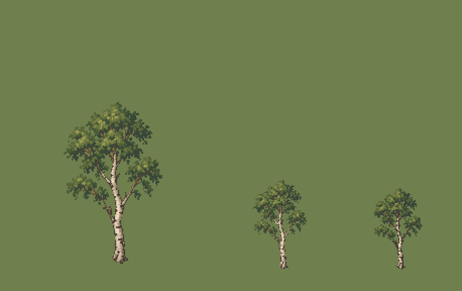

# QA — trees-source-v1

Source: `art/generated/trees-source-v1` · exported by `art/tools/export.mjs` · deterministic: re-running gives identical files.

## `PRP_TREES_BROADLEAF_MEDIUM` — variant 01

| | |
|---|---|
| Source | `art/generated/trees-source-v1/broadleaf.png` · 1024 × 1536 · sha256 `591c0b23e42da090` |
| Output | `art/qa/trees-source-v1/prp_trees_broadleaf_medium_01@2x.png` · subject 130 × 160 on 192 × 256 |
| Matte removal | dark matte ≤ 40 luminance, 3051 px cleared |
| Palette | 24 colours: `#2a3337` `#373734` `#41513f` `#584636` `#556543` `#566644` `#586945` `#5a6b46` `#5d4134` `#5d543c` `#5c6b46` `#5b6c46` `#5c6d47` `#664636` `#6c553c` `#875d42` `#69774a` `#838b51` `#8a9253` `#8b9354` `#8e8f52` `#af7c52` `#959a57` `#b7b060` |
| Machine checks | **PASS** |
| Human review (0.55 zoom, silhouette) | Claude: pass — halo removed by dark matte; reads at 0.55. Not promoted: gate sheets (ART_BIBLE §11) await owner approval. |
| Promoted | no |

- ✅ canvas size — 192 × 256 (spec 192 × 256)
- ✅ binary alpha — every pixel is 0 or 255
- ✅ colour cap — 24 colours (cap 24)
- ✅ no pure black or white — none
- ✅ no functional hue — none
- ✅ pivot — ground row 244, centre 95.5 (spec 244, 96)
- ✅ @1x is exactly half — 96 × 128

## `PRP_TREES_CONIFER_MEDIUM` — variant 01

| | |
|---|---|
| Source | `art/generated/trees-source-v1/conifer.png` · 1024 × 1536 · sha256 `24d613e70ff9b7b2` |
| Output | `art/qa/trees-source-v1/prp_trees_conifer_medium_01@2x.png` · subject 92 × 160 on 192 × 256 |
| Matte removal | dark matte ≤ 40 luminance, 726 px cleared |
| Palette | 24 colours: `#263336` `#33453b` `#414334` `#40523a` `#42543b` `#44563c` `#4b362e` `#4c4434` `#495a3e` `#4b5b3e` `#4d5d40` `#524432` `#51603f` `#526142` `#536343` `#5b4134` `#615038` `#7b553d` `#606d47` `#727a4c` `#986b48` `#87824f` `#8b8a53` `#929056` |
| Machine checks | **PASS** |
| Human review (0.55 zoom, silhouette) | Claude: pass — halo removed by dark matte; reads at 0.55. Not promoted: gate sheets (ART_BIBLE §11) await owner approval. |
| Promoted | no |

- ✅ canvas size — 192 × 256 (spec 192 × 256)
- ✅ binary alpha — every pixel is 0 or 255
- ✅ colour cap — 23 colours (cap 24)
- ✅ no pure black or white — none
- ✅ no functional hue — none
- ✅ pivot — ground row 244, centre 95.5 (spec 244, 96)
- ✅ @1x is exactly half — 96 × 128

## `PRP_TREES_BIRCH_MEDIUM` — variant 01

| | |
|---|---|
| Source | `art/generated/trees-source-v1/birch.png` · 1024 × 1536 · sha256 `ef173acd85f58bbe` |
| Output | `art/qa/trees-source-v1/prp_trees_birch_medium_01@2x.png` · subject 98 × 160 on 192 × 256 |
| Matte removal | dark matte ≤ 40 luminance, 902 px cleared |
| Palette | 24 colours: `#3c3a34` `#384738` `#435336` `#554437` `#516038` `#566439` `#5e5d3a` `#606c3c` `#6b4c35` `#6b663c` `#656a41` `#735e51` `#836953` `#6b7640` `#7a8245` `#907d6a` `#969951` `#a28c67` `#a69279` `#9d9f55` `#b09c84` `#c7b297` `#dac7aa` `#ecdbc1` |
| Machine checks | **PASS** |
| Human review (0.55 zoom, silhouette) | Claude: pass — halo removed by dark matte; reads at 0.55. Not promoted: gate sheets (ART_BIBLE §11) await owner approval. |
| Promoted | no |

- ✅ canvas size — 192 × 256 (spec 192 × 256)
- ✅ binary alpha — every pixel is 0 or 255
- ✅ colour cap — 24 colours (cap 24)
- ✅ no pure black or white — none
- ✅ no functional hue — none
- ✅ pivot — ground row 244, centre 95.5 (spec 244, 96)
- ✅ @1x is exactly half — 96 × 128

