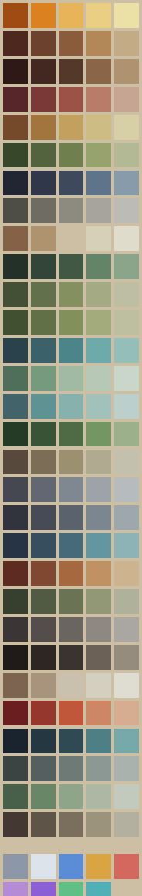

<!-- GENERATED by art/tools/reference.mjs from ART_BIBLE.md §6.2. Change the bible, then rerun. -->

# REF_PALETTE_MASTER

**Status: APPROVED by the design owner, 2026-09-12** (gate sheet, ART_BIBLE.md §11). 30 material ramps × 5 steps + 9 functional hues = **159 colours**. Regenerating after a change to ART_BIBLE §6.2 changes the palette, and the changed palette needs approving again.

Bases are read from ART_BIBLE.md §6.2; each ramp shifts cooler toward blue in the shadows and warmer toward yellow in the highlights (§6.3). The nine functional hues (§6.1) sit in their own band, unramped: they are signal, not material, and may not be used decoratively.

| Group | Colour | Shadow | Core shadow | **Base** | Light | Highlight |
|---|---|---|---|---|---|---|
| Guild / town | Honey lantern gold | `#9f4b12` | `#dc811f` | **`#e8b45a`** | `#eace81` | `#ebe0a5` |
| Guild / town | warm timber | `#4d281f` | `#6c412e` | **`#8a5c3b`** | `#b38756` | `#c3ac85` |
| Guild / town | dark timber | `#2f1917` | `#422821` | **`#54382a`** | `#8b6548` | `#af9270` |
| Guild / town | faded brick red | `#57262a` | `#7a3937` | **`#9c5347`** | `#b87c69` | `#c7a593` |
| Guild / town | thatch | `#754a2a` | `#a3753e` | **`#c2a05e`** | `#cdbc83` | `#d7cfa6` |
| Guild / town | moss green | `#37472a` | `#52633d` | **`#6f7f4e`** | `#97a36d` | `#b4b995` |
| Guild / town | slate-blue shadow | `#222633` | `#303748` | **`#3e4a5c`** | `#5f748a` | `#879ba9` |
| Guild / town | stone | `#4e4e46` | `#6f6d63` | **`#8d8a80`** | `#a6a49c` | `#bcbbb6` |
| Guild / town | canvas | `#836247` | `#af936f` | **`#ccbfa3`** | `#d6d0b8` | `#e0dccb` |
| Verdant Reach (Blue) | Land dark | `#233129` | `#334538` | **`#415845`** | `#638466` | `#8ba58a` |
| Verdant Reach (Blue) | land light | `#435035` | `#63704c` | **`#859061`** | `#a4aa83` | `#bdbea4` |
| Verdant Reach (Blue) | grass detail | `#415031` | `#617047` | **`#82905b`** | `#a3ab7d` | `#bdbfa0` |
| Verdant Reach (Blue) | water | `#29424c` | `#3b626b` | **`#4c8589`** | `#6caba9` | `#94beb8` |
| Verdant Reach (Blue) | water bank | `#506f5b` | `#759a7e` | **`#a1baa4`** | `#b6c9b7` | `#cbd6ca` |
| Verdant Reach (Blue) | water highlight | `#426369` | `#5f9293` | **`#86b1ad`** | `#a1c1bb` | `#bbd0ca` |
| Verdant Reach (Blue) | canopy | `#263b25` | `#395336` | **`#4e6b45`** | `#749663` | `#9cb08c` |
| Verdant Reach (Blue) | trail dust | `#574a3c` | `#7b6d56` | **`#9b9070`** | `#b0ab90` | `#c3c0ae` |
| Coldwater Quarry (Yellow) | Cut stone | `#454851` | `#626772` | **`#7f8791`** | `#9ca3a9` | `#b6bbbe` |
| Coldwater Quarry (Yellow) | slate | `#31343c` | `#464b55` | **`#5a626d`** | `#7b8691` | `#9da7ac` |
| Coldwater Quarry (Yellow) | cold water | `#263443` | `#374e5e` | **`#476a78`** | `#6496a1` | `#8eb3b7` |
| Coldwater Quarry (Yellow) | rust | `#5d2b21` | `#814831` | **`#a6683f`** | `#c09163` | `#cdb48e` |
| Coldwater Quarry (Yellow) | sparse scrub | `#37402e` | `#515a42` | **`#6b7355`** | `#929775` | `#afb19a` |
| Ashfall Barrows (Black) | Ash | `#3b3635` | `#534e4b` | **`#6b6560`** | `#8d8881` | `#aaa7a2` |
| Ashfall Barrows (Black) | scorched earth | `#201a19` | `#2d2724` | **`#3a332e`** | `#6b6156` | `#958c7e` |
| Ashfall Barrows (Black) | bone | `#7d6451` | `#a8947d` | **`#c9c0ae`** | `#d4d0c0` | `#dfdcd1` |
| Ashfall Barrows (Black) | ember | `#6b1e20` | `#96372d` | **`#c0563a`** | `#cd8666` | `#d6ad91` |
| The Sunken Choirhouse (Red) | Deep water | `#19242e` | `#253740` | **`#2f4a52`** | `#4f7f86` | `#77a9aa` |
| The Sunken Choirhouse (Red) | wet stone | `#3c4343` | `#555f5d` | **`#6d7a76`** | `#8c9893` | `#aab2ae` |
| The Sunken Choirhouse (Red) | pale algae | `#485f49` | `#698667` | **`#8fa58a`** | `#aab8a4` | `#c1cabc` |
| The Sunken Choirhouse (Red) | silt | `#443932` | `#5f5448` | **`#7a6f5c`** | `#9b937c` | `#b3b09f` |

Functional: `#8c98a8` `#dde3ea` `#5b8dd6` `#d9a441` `#d4685f` `#b58bd6` `#8c5fd6` `#5fbf87` `#4fb0b8`
